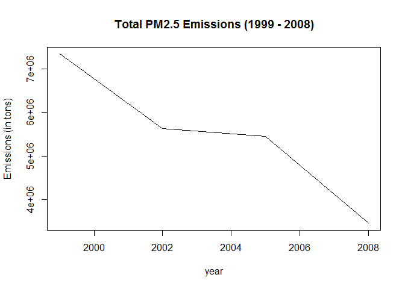
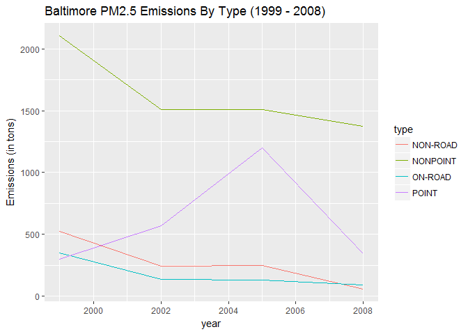
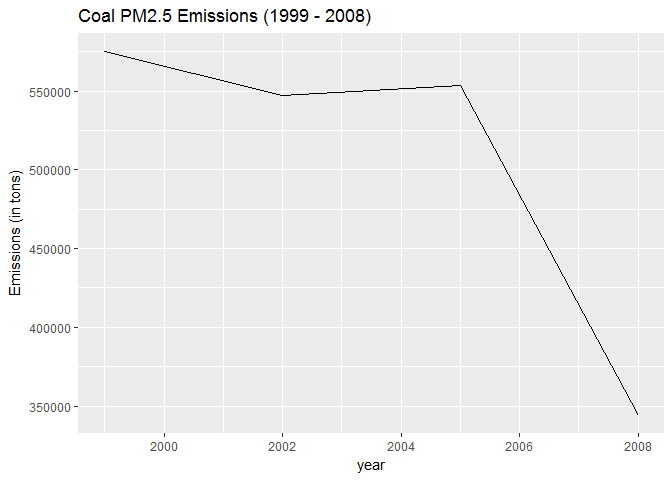
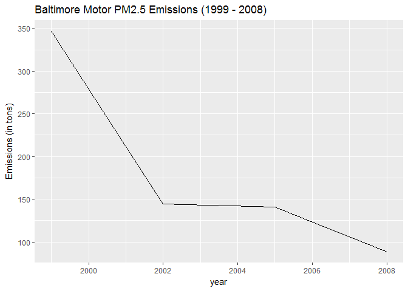
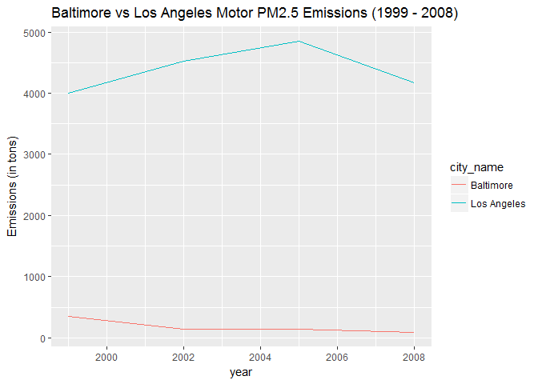

# Exploratory Data Analysis - Course Project 2
Lavanya Viswanathan  
April 14, 2017  

## Assignment Summary

The goal of this assignment is to use plots to do preliminary exploratory analyses of PM2.5 emissions (in tons) from 1999 to 2008.

## Read the data


```
## 
## Attaching package: 'dplyr'
```

```
## The following objects are masked from 'package:stats':
## 
##     filter, lag
```

```
## The following objects are masked from 'package:base':
## 
##     intersect, setdiff, setequal, union
```

The input data was loaded using **readRDS()**, as instructed in the assignment. The joined data from both files, using the SCC character code key, has 6,497,651 rows and 20 columns.


```r
NEI <- readRDS("summarySCC_PM25.rds")
SCC <- readRDS("Source_Classification_Code.rds")
SCC$SCC <- as.character(SCC$SCC)
data <- left_join(NEI,SCC,by="SCC")
data_sn <- unique(data$Short.Name)
years <- as.vector(unique(NEI$year))
str(data)
```

```
## 'data.frame':	6497651 obs. of  20 variables:
##  $ fips               : chr  "09001" "09001" "09001" "09001" ...
##  $ SCC                : chr  "10100401" "10100404" "10100501" "10200401" ...
##  $ Pollutant          : chr  "PM25-PRI" "PM25-PRI" "PM25-PRI" "PM25-PRI" ...
##  $ Emissions          : num  15.714 234.178 0.128 2.036 0.388 ...
##  $ type               : chr  "POINT" "POINT" "POINT" "POINT" ...
##  $ year               : int  1999 1999 1999 1999 1999 1999 1999 1999 1999 1999 ...
##  $ Data.Category      : Factor w/ 6 levels "Biogenic","Event",..: 6 6 6 6 6 6 6 6 6 6 ...
##  $ Short.Name         : Factor w/ 11238 levels "","2,4-D Salts and Esters Prod /Process Vents, 2,4-D Recovery: Filtration",..: 3339 3340 3300 3424 3391 3410 3408 3268 3247 3246 ...
##  $ EI.Sector          : Factor w/ 59 levels "Agriculture - Crops & Livestock Dust",..: 20 20 20 25 25 24 24 15 15 15 ...
##  $ Option.Group       : Factor w/ 25 levels "","C/I Kerosene",..: 1 1 1 1 1 1 1 1 1 1 ...
##  $ Option.Set         : Factor w/ 18 levels "","A","B","B1A",..: 1 1 1 1 1 1 1 1 1 1 ...
##  $ SCC.Level.One      : Factor w/ 17 levels "Brick Kilns",..: 3 3 3 3 3 3 3 3 3 3 ...
##  $ SCC.Level.Two      : Factor w/ 146 levels "","Agricultural Chemicals Production",..: 32 32 32 52 52 52 52 22 22 22 ...
##  $ SCC.Level.Three    : Factor w/ 1061 levels "","100% Biosolids (e.g., sewage sludge, manure, mixtures of these matls)",..: 886 886 317 886 317 692 692 886 317 317 ...
##  $ SCC.Level.Four     : Factor w/ 6084 levels "","(NH4)2 SO4 Acid Bath System and Evaporator",..: 2545 2546 2548 2544 2525 30 3 2544 2548 2525 ...
##  $ Map.To             : num  NA NA NA NA NA NA NA NA NA NA ...
##  $ Last.Inventory.Year: int  NA NA NA NA NA NA NA NA NA NA ...
##  $ Created_Date       : Factor w/ 57 levels "","1/27/2000 0:00:00",..: 1 1 1 1 1 1 1 1 1 1 ...
##  $ Revised_Date       : Factor w/ 44 levels "","1/27/2000 0:00:00",..: 1 1 1 1 1 1 1 1 1 1 ...
##  $ Usage.Notes        : Factor w/ 21 levels ""," ","includes bleaching towers, washer hoods, filtrate tanks, vacuum pump exhausts",..: 1 1 1 1 1 1 1 1 1 1 ...
```

## Plot 1 - Total PM2.5 Emissions

Total PM2.5 Emissions have dropped 53%, from 7.3 million tons in 1999 to 3.5 million tons in 2008, although the drop from 2002 to 2005 was much less pronounced (3%)

The R code for this base plot is in <https://github.com/lavanyav0/ExData_Plotting2/plot1.R>, and the output plot is in <https://github.com/lavanyav0/ExData_Plotting2/plot1.png>.


```r
NEI_Total <- NEI %>% group_by(year) %>% summarize(Emissions = sum(Emissions))
NEI_Total
```

```
## # A tibble: 4 × 2
##    year Emissions
##   <int>     <dbl>
## 1  1999   7332967
## 2  2002   5635780
## 3  2005   5454703
## 4  2008   3464206
```

```r
title <- paste("Total PM2.5 Emissions (",as.character(years[1])," - ",as.character(years[length(years)]),")",sep="")
plot(NEI_Total,type="l",ylab="Emissions (in tons)",main=title)
```

<!-- -->

```r
dev.copy(png,file="plot1.png",width=480,height=480)
```

```
## png 
##   3
```

```r
dev.off()
```

```
## png 
##   2
```

## Plot 2 - Total PM2.5 Emissions in Baltimore City

Total PM2.5 Emissions in Baltimore City have dropped 43%, from 3,274 tons in 1999 to 1,862 tons in 2008, but increased 26% from 2002 to 2005.

The R code for this base plot is in <https://github.com/lavanyav0/ExData_Plotting2/plot2.R>, and the output plot is in <https://github.com/lavanyav0/ExData_Plotting2/plot2.png>.


```r
NEI_Baltimore <- NEI %>% 
  filter(fips=="24510") %>%
  group_by(year) %>% 
  summarize(Emissions=sum(Emissions))
NEI_Baltimore
```

```
## # A tibble: 4 × 2
##    year Emissions
##   <int>     <dbl>
## 1  1999  3274.180
## 2  2002  2453.916
## 3  2005  3091.354
## 4  2008  1862.282
```

```r
title <- paste("Baltimore PM2.5 Emissions (",as.character(years[1])," - ",as.character(years[length(years)]),")",sep="")
plot(NEI_Baltimore,type="l",ylab="Emissions (in tons)",main=title)
```

<!-- -->

```r
dev.copy(png,file="plot2.png",width=480,height=480)
```

```
## png 
##   3
```

```r
dev.off()
```

```
## png 
##   2
```

## Plot 3 - Total PM2.5 Emissions in Baltimore City by Type

Between 1999 and 2008, PM2.5 Emissions in Baltimore City dropped for three types (NONPOINT, ON-ROAD and NON-ROAD) but increased for one type (POINT).

The R code for this ggplot2 is in <https://github.com/lavanyav0/ExData_Plotting2/plot3.R>, and the output plot is in <https://github.com/lavanyav0/ExData_Plotting2/plot3.png>.


```r
NEI_Baltimore <- NEI %>% 
  filter(fips=="24510") %>%
  group_by(type,year) %>% 
  summarize(Emissions=sum(Emissions))
NEI_Baltimore
```

```
## Source: local data frame [16 x 3]
## Groups: type [?]
## 
##        type  year  Emissions
##       <chr> <int>      <dbl>
## 1  NON-ROAD  1999  522.94000
## 2  NON-ROAD  2002  240.84692
## 3  NON-ROAD  2005  248.93369
## 4  NON-ROAD  2008   55.82356
## 5  NONPOINT  1999 2107.62500
## 6  NONPOINT  2002 1509.50000
## 7  NONPOINT  2005 1509.50000
## 8  NONPOINT  2008 1373.20731
## 9   ON-ROAD  1999  346.82000
## 10  ON-ROAD  2002  134.30882
## 11  ON-ROAD  2005  130.43038
## 12  ON-ROAD  2008   88.27546
## 13    POINT  1999  296.79500
## 14    POINT  2002  569.26000
## 15    POINT  2005 1202.49000
## 16    POINT  2008  344.97518
```

```r
title <- paste("Baltimore PM2.5 Emissions By Type (",as.character(years[1])," - ",as.character(years[length(years)]),")",sep="")
g <- ggplot(NEI_Baltimore,aes(x=year,y=Emissions,group=type,color=type))
print(g + geom_line() + labs(y = "Emissions (in tons)") + labs(title=title))
```

<!-- -->

```r
dev.copy(png,file="plot3.png",width=480,height=480)
```

```
## png 
##   3
```

```r
dev.off()
```

```
## png 
##   2
```

## Plot 4 - PM2.5 Emissions from Coal Combustion-related Sources

We filtered on the Source.Name column to identify sources related to coal combustion. If the string contained either **"Coal"** or **"Comb"**, it was classified as a coal combustion source. PM2.5 emissions due to coal combustion-related sources dropped 40% from 575,207 tons in 1999 to 343,979 tons in 2008.

The R code for this ggplot2 is in <https://github.com/lavanyav0/ExData_Plotting2/plot4.R>, and the output plot is in <https://github.com/lavanyav0/ExData_Plotting2/plot4.png>.


```r
coal_combustion_sources <- data_sn[grep("Coal",data_sn)]
coal_combustion_sources <- coal_combustion_sources[grep("Comb",coal_combustion_sources)]
NEI_Coal <- data %>%
  filter(Short.Name %in% coal_combustion_sources) %>%
  group_by(year) %>% 
  summarize(Emissions=sum(Emissions))
NEI_Coal
```

```
## # A tibble: 4 × 2
##    year Emissions
##   <int>     <dbl>
## 1  1999  575206.5
## 2  2002  547380.1
## 3  2005  553549.4
## 4  2008  343979.3
```

```r
title <- paste("Coal PM2.5 Emissions (",as.character(years[1])," - ",as.character(years[length(years)]),")",sep="")
g <- ggplot(NEI_Coal,aes(x=year,y=Emissions))
print(g + geom_line() + labs(y = "Emissions (in tons)") + labs(title=title))
```

<!-- -->

```r
dev.copy(png,file="plot4.png",width=480,height=480)
```

```
## png 
##   3
```

```r
dev.off()
```

```
## png 
##   2
```

## Plot 5 - PM2.5 Emissions from Motor Vehicles in Baltimore City

We filtered on the Source.Name column to identify motor vehicle sources. If the string contained either **"Motor"** or **"Veh"**, it was classified as a motor vehicle source. PM2.5 emissions due to motor vehicles sources in Baltimore dropped 75% from 347 tons in 1999 to 88 tons in 2008.

The R code for this ggplot2 is in <https://github.com/lavanyav0/ExData_Plotting2/plot5.R>, and the output plot is in <https://github.com/lavanyav0/ExData_Plotting2/plot5.png>.


```r
motor_sources <- data_sn[grep("Motor|Veh",data_sn)]
NEI_Balt_Motor <- data %>%
  filter(fips=="24510" & Short.Name %in% motor_sources) %>%
  group_by(year) %>% 
  summarize(Emissions=sum(Emissions))
NEI_Balt_Motor
```

```
## # A tibble: 4 × 2
##    year Emissions
##   <int>     <dbl>
## 1  1999 346.82000
## 2  2002 144.47882
## 3  2005 140.60038
## 4  2008  88.27546
```

```r
title <- paste("Baltimore Motor PM2.5 Emissions (",as.character(years[1])," - ",as.character(years[length(years)]),")",sep="")
g <- ggplot(NEI_Balt_Motor,aes(x=year,y=Emissions))
print(g + geom_line() + labs(y = "Emissions (in tons)") + labs(title=title))
```

<!-- -->

```r
dev.copy(png,file="plot5.png",width=480,height=480)
```

```
## png 
##   3
```

```r
dev.off()
```

```
## png 
##   2
```

## Plot 6 - PM2.5 Emissions from Motor Vehicles in Baltimore City vs Los Angeles

We filtered on the Source.Name column to identify motor vehicle sources. If the string contained either **"Motor"** or **"Veh"**, it was classified as a motor vehicle source. The graph shows clearly that emissions in Los Angeles are much higher than in Baltimore (from 1054% in 1999 to 4642% higher in 2008). The graph also shows that PM2.5 emissions from motor vehicle sources increased 4% in Los Angeles from 1999 to 2008, while it decreased 75% in Baltimore over the same period.

The R code for this ggplot2 is in <https://github.com/lavanyav0/ExData_Plotting2/plot6.R>, and the output plot is in <https://github.com/lavanyav0/ExData_Plotting2/plot6.png>.


```r
motor_sources <- data_sn[grep("Motor|Veh",data_sn)]
NEI_Balt_LA_Motor <- data %>%
  filter((fips=="24510"|fips=="06037") & Short.Name %in% motor_sources) %>%
  group_by(fips,year) %>% 
  summarize(Emissions=sum(Emissions))
fips <- as.vector(NEI_Balt_LA_Motor$fips)
cities <- as.vector(sapply(fips,function(x) if(x=="24510") "Baltimore" else "Los Angeles"))
NEI_Balt_LA_Motor$city_name <- cities
NEI_Balt_LA_Motor
```

```
## Source: local data frame [8 x 4]
## Groups: fips [?]
## 
##    fips  year  Emissions   city_name
##   <chr> <int>      <dbl>       <chr>
## 1 06037  1999 4005.31600 Los Angeles
## 2 06037  2002 4522.44020 Los Angeles
## 3 06037  2005 4852.80493 Los Angeles
## 4 06037  2008 4173.37250 Los Angeles
## 5 24510  1999  346.82000   Baltimore
## 6 24510  2002  144.47882   Baltimore
## 7 24510  2005  140.60038   Baltimore
## 8 24510  2008   88.27546   Baltimore
```

```r
title <- paste("Baltimore vs Los Angeles Motor PM2.5 Emissions (",as.character(years[1])," - ",as.character(years[length(years)]),")",sep="")
g <- ggplot(NEI_Balt_LA_Motor,aes(x=year,y=Emissions,group=city_name,color=city_name))
print(g + geom_line() + labs(y = "Emissions (in tons)") + labs(title=title))
```

<!-- -->

```r
dev.copy(png,file="plot6.png",width=480,height=480)
```

```
## png 
##   3
```

```r
dev.off()
```

```
## png 
##   2
```
